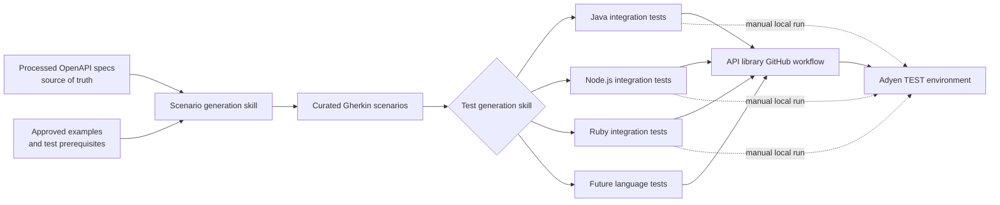

# API library integration testing

> Status: proposed solution based on the
> [API Excellence Hackathon FigJam](https://www.figma.com/board/uiR6u15MPyuMB3jeNDkNO5/API-Excellence-Hackathon-Integration-test?node-id=0-1&p=f&t=7vrqUYmAjHfbARIO-0).

## Problem

Adyen API libraries expose the same APIs in multiple programming languages, but
each library has its own public types, naming conventions, test framework,
configuration, and resource lifecycle. A test copied from one library therefore
cannot be reused directly in another.

Unit tests and generated-code checks prove that an SDK is internally
consistent. They do not prove that its public client can send a valid request
to Adyen and handle the real response. Maintaining those integration tests
manually in every API library is expensive and leads to inconsistent coverage.

The solution must:

- keep the processed OpenAPI specifications used to generate the SDKs as the
  source of truth for operations, schemas, parameters, responses, and examples;
- describe intended API behavior once, independently of any SDK language;
- generate idiomatic tests that use each library's public API;
- execute only against the Adyen TEST environment, never LIVE;
- support automated GitHub execution and manual local execution;
- make missing, skipped, manual, and impractical coverage visible;
- avoid credentials and real resource identifiers in source control.

## Solution

Use a two-stage generation process.

1. **Generate scenarios.** A scenario-generation skill resolves an operation
   from the processed OpenAPI specification, selects an approved example, and
   creates or updates a language-agnostic Gherkin scenario.
2. **Generate SDK tests.** A test-generation skill translates the curated
   scenarios into native integration tests for a selected API library. It
   follows that library's existing test conventions and uses only its public
   client, services, models, and error types.

Gherkin is the contract between the two stages. It records the request,
runtime inputs, operation, and stable assertions without prescribing Java,
Node.js, Ruby, or another language's implementation.

Generation and execution are separate concerns. Generation can compile or lint
the produced source, but it must not make API calls. A dedicated workflow or a
developer explicitly running the integration-test command executes the tests.

## Workflow

### 1. Create or update a scenario

The scenario-generation skill:

- resolves the API, version, operation, parameters, request schema, documented
  `2xx` responses, and examples from the processed OpenAPI specification;
- uses API Explorer as a view of official examples when needed, while
  validating the result against the specification;
- asks for input instead of inventing missing examples or resource IDs;
- replaces environment-specific values with declarative runtime bindings;
- writes reviewable Gherkin under
  `integration-test-generator/test-scenarios/<api>/<service>.feature`;
- marks execution constraints explicitly, for example `@test-only`,
  `@read-only`, `@side-effect`, `@manual`, or `@contract-only`.

Scenarios assert only stable behavior required to prove success. They should
not encode SDK class names, test-framework details, credentials, or LIVE
configuration.

### 2. Generate language-specific tests

For a selected language, the test-generation skill reads all curated scenarios
and the target API library. The target library is authoritative for:

- test file and test case naming;
- test framework and assertion style;
- client setup and TEST environment selection;
- request construction and response/error handling;
- runtime configuration and resource lifecycle.

The generator performs a full preflight before editing files. It stops if an
operation, public type, required test resource, destination, or runtime binding
cannot be resolved safely. Generated tests contain the exact Gherkin scenario
title, allowing scenario-to-test coverage to be measured.

The initial implementation supports Java, Node.js, and Ruby. Adding another
language requires defining and validating that library's native conventions,
not copying the implementation of an existing language.

### 3. Validate and execute

Two validation levels are intentionally separated:

1. **Generation validation:** compile, type-check, or lint the generated test
   source without discovering or executing integration tests.
2. **Integration execution:** run the tests through a dedicated API-library
   GitHub workflow, or manually with the library's documented command.

Execution must have these safeguards:

- the client is pinned to TEST and cannot be switched to LIVE by test input;
- credentials and resource IDs come from GitHub secrets or local environment
  variables;
- logs and reports do not expose secret values;
- side-effecting tests use unique references and idempotency keys;
- workflows define timeouts, concurrency, and cleanup where resources are
  created;
- manual or unavailable prerequisites produce an explicit skip or exclusion,
  not a false pass.

## Main components

| Component | Responsibility |
|---|---|
| Processed OpenAPI specifications | Source of truth for operations, parameters, schemas, documented responses, and official examples. These are the same inputs used for SDK generation. |
| Scenario-generation skill | Converts one OpenAPI operation and selected example into curated, language-agnostic Gherkin. It validates inputs and never calls Adyen. |
| Scenario repository | Stores shared behavior under `integration-test-generator/test-scenarios`. Tags capture service, response, execution mode, side effects, and prerequisites. |
| Test-generation skill | Maps every shared scenario to an idiomatic test in one selected API library, after inspecting that library's public API and test conventions. |
| API-library test infrastructure | Provides TEST-only clients, credentials, merchant accounts, resource IDs, fixtures, and cleanup using language-specific conventions. |
| GitHub workflows | Generate or verify test source and run eligible integration tests against TEST using protected secrets. |
| Coverage reporting | Correlates OpenAPI operations, documented successful responses, scenarios, generated tests per language, and execution results. |

## Regeneration strategy

A hybrid model gives useful automation without allowing generated changes to
land without review:

- run a non-mutating verification when an OpenAPI specification, shared
  scenario, generation skill, or API-library public surface changes;
- provide a manually dispatched workflow that regenerates tests and opens or
  updates a pull request with the diff;
- allow maintainers to invoke both skills locally while developing or
  investigating a failure;
- never silently rewrite tests directly on a protected default branch.

The exact trigger and ownership model remain open questions. Regardless of the
trigger, generated tests should be reproducible: the same specification,
scenario, skill version, and library version should produce the same source.

## Measuring coverage

A single percentage would hide important gaps. Report coverage as a matrix with
at least these dimensions:

| Dimension | Example measure |
|---|---|
| OpenAPI to scenario | Eligible operations and documented `2xx` responses with at least one scenario |
| Scenario to SDK | Shared executable scenarios represented by exactly one generated test in each supported language |
| Execution | Generated tests run, passed, failed, skipped, or manual in the latest TEST workflow |
| Prerequisites | Scenarios blocked by unavailable accounts, capabilities, resource IDs, webhooks, or asynchronous setup |
| Contract-only | Responses validated against schemas/examples but not proven through a live API call |

Every exclusion should have a machine-readable reason and an owner or review
date. This keeps an impractical scenario visible without treating it as either
covered or failed.

## Impractical scenarios

Some documented behavior cannot be exercised reliably in a shared automated
TEST account. Examples include operations that require:

- regulated onboarding or account capabilities;
- physical devices, external systems, or human interaction;
- long-running asynchronous state transitions or inbound webhooks;
- destructive lifecycle actions with no safe cleanup;
- rare states that cannot be created through a public API;
- region-specific or merchant-specific configuration.

These scenarios should not be replaced with fake integration tests. Depending
on what can be proven, mark them as:

- **manual**, when a controlled TEST procedure exists;
- **contract-only**, when only a documented example and schema can be
  validated;
- **blocked**, when a prerequisite is missing but could be provided later;
- **out of scope**, when automation is unsafe or infeasible.

The reason must be retained in coverage reporting. Mocks remain suitable for
unit tests, but do not count as real API integration coverage.

## Open questions and challenges

1. **Generation trigger:** Should test regeneration happen for every relevant
   OpenAPI change, on a schedule, through manual dispatch, or only on demand?
2. **Pull request ownership:** Should automation update an existing SDK
   generation pull request or create a separate integration-test pull request?
3. **Drift handling:** Should CI fail when generated tests differ from the
   committed source, or only publish a report and proposed patch?
4. **Scenario review:** Who approves the selected example, assertions, side
   effects, and required runtime bindings?
5. **Coverage denominator:** Which OpenAPI operations and successful responses
   are considered eligible, especially webhooks, file transfers, and
   configuration-dependent operations?
6. **Language parity:** Must every supported language implement every
   executable scenario before a change can merge, or may libraries progress
   independently?
7. **Language conventions:** How should generators handle builders versus
   constructors, synchronous versus asynchronous clients, typed models versus
   hashes, and different error representations?
8. **Test data ownership:** Which team provisions and maintains shared TEST
   accounts, merchant capabilities, resource IDs, and cleanup policies?
9. **Isolation and concurrency:** Can workflows share TEST resources safely,
   or does each run need dedicated accounts or namespaced resources?
10. **Flakiness:** How should retries, eventual consistency, rate limits, and
    transient TEST-environment incidents be distinguished from SDK defects?
11. **Secrets and forks:** Which workflows may access TEST credentials, and
    how are pull requests from forks validated without exposing secrets?
12. **Impractical scenarios:** What metadata, approval, owner, and expiry are
    required for manual, contract-only, blocked, or out-of-scope coverage?
13. **Versioning:** How are scenario and generator changes tied to the OpenAPI
    and API-library versions used to produce a test?
14. **Failure routing:** Who owns failures caused by the API, OpenAPI example,
    SDK generator, language implementation, test infrastructure, or TEST data?
